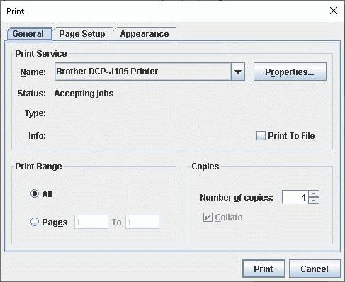
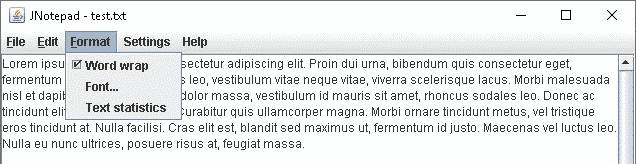
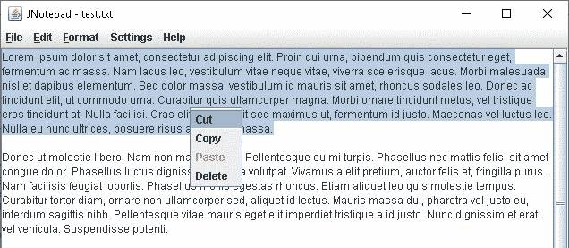

## Overwiev

JNotepad - simple and lightweight notepad. Project evolved from school project. I'm stil developing it despite it's using quite old Swing UI, so any suggestions on new functionalities are more than welcome. Current version: 0.4

## Main view
Program is divided into 3 sections: Menu Bar, Text Area and panel with radiobuttons in the bottom:

## Coding changer

A simple set of radio buttons allow user to change text coding __on the fly__, without a need to reopen the file. Nice feature if user is not sure which coding file is using:

## File menu:

All functionalities already implemented: New, Open, Save, Save as..., Print, Exit. "Save" is deactivated until user saves new file first time via "Save as..." or makes changes in a current file.

### Open/Save/Save as... File Choosers

Each functionality have default swing FileChooser implemented:

### Print dialog

Allows user to choose one of the printers available in the OS:

## Edit menu

Features implemented so far: basic text operations (Copy, Paste, Cut, Delete). Text operations support actions from and to System Clipboards, so text is availale to and from other applications. All basic text operations are active only if it does make sense (Paste - activated where there's a text available in system Clipboard, cut, copy and delete - when text is selected.

## Format menu

Available features: word wrap, font changer and text statistics:

### Word wrap

In Format File Menu - word wrap feature implemented - line divisions are made on white spaces (words are not being divided):

### Font changer

Dialog window allows user to change Font name, style and size. (Third party feature, license in "license" folder.

### Text statistics

Simple statistics: lines of text, words, characters (with and without whitespaces)

## Settings menu

Featured in Swing library - possbility to choose between the following skins:

## Others

### Context menu

Available on text area, implemented features - basic text operations. As in Edit Menu, operations are active only when it does make sense (e.g. "Paste" is active only if there's some text in OS Clipboard.

### User warnings

Application have the following warnings implemented:

- File not save warnings - when user wants to exit without saving text area or to open new/existing file before saving text area:

- File already exist warning - when user wants to save file with the file name that already exists in current folder:

## History and updates

### Features added to v04:
- word wrap improved (words are not being divided durin wrap operations)
- basic text operations (Menu/Edit: Cut, Copy, Paste) - with both mouse ad keyboard support, activation in sync with OS Clipboard
- font settings dialog in Edit menu
- text statistics
- context menu with basic text operations, activation in sync wit OS Clipboard
- printing dialog and functionality via OS Print

## Features added to v03:
- architecture improved (classes regrouped into three packages to reflect MVC architecture)
- save method is checking if the file already exist in given directory
- save split into "save" ad "save as...", also "save" deactivated until first USE OF "save as..." OR "open" 
- method added to check if text area is updated from last save operation - if it does, prompt window is called 
  an user is requested to confirm before he exits program. Method is also requesting for user confirmation 
  if opens a new file without saving current one.
- global working directory is create after first use of "save" or "open"

## Features to be added in next releases:
- "save as..." - reopen chooser if user drops overwriting the file (for user convenience)
- continous save (?)
- \*.txt as default file format during "save as..." operation
-  select all from menu
- program should be taking control over the open file (blocked for cut/copy delete from OS shell, unavailable for other apps while opened)
- hints to be added
- helpfile to be added
- welcome graphics before any User action taken (?)
- JUnit tests
- javadoc class descriptions
- menubuilder pattern in context menu
- laguage versions (?)
- license file
- printing - pages selector, print selected text only feature
- number of pages to text stats
- "Find" and "Replac"e feature

## Known bugs to be fixed asap:
- skin radio buttons are not refreshing during skin change
- skin change doesn't affect application top bar - to be fixed in next update
- while pasting code to text area - ClassNotFoundException
