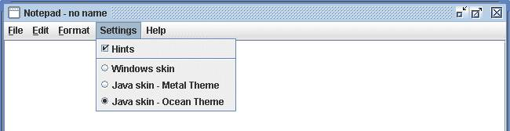

## Overwiev

JNotepad - simple and lightweight notepad. Project evolved from school project. I'm stil developing it despite it's using quite old Swing UI, so any suggestions on new functionalities are more than welcome. Current version: 0.5

## Main view
Program is divided into 3 sections: Menu Bar, Text Area and panel with radiobuttons in the bottom:

## Coding changer

A simple set of radio buttons allow user to change text coding __on the fly__, without a need to reopen the file. Nice feature if user is not sure which coding file is using:

## File menu

All features already implemented: New, Open, Save, Save as..., Print, Exit. "Save" is deactivated until user saves new file first time via "Save as..." or makes changes in a current file.

### Open/Save/Save as... File Choosers

Each functionality have default swing FileChooser implemented:

### Print dialog

Allows user to choose one of the printers available in the OS:

## Edit menu

All seatures already implemented: basic text operations (Copy, Paste, Cut, Delete), find text, replace text and select all.
Text operations support actions from and to System Clipboard, so text is availale to and from other applications. All basic text operations are active only if it does make sense (Paste - activated where there's a text available in system Clipboard, cut, copy and delete - when text is selected).

### Find dialog

User can search for text both forward (from cursor to the end of file) ad backwards (from cursor to the beginning of the file). Search direction can be changed any moment without resetting dialog window. Case sensitivity can be turned on and off on the fly as well by checking dedicated checkbox.

### Replace dialog

After searching or the text from "Find" text area (same functionality as in find dialog) user can replace text found (selected in main window) with text typed in "replace" text area". It can be done cae by case by "Replace button" or all at once by "Replace all" button - in this case cursor position doesn't matter, all occurences will be replaced.

## Format menu

Available features: word wrap, font changer and text statistics:

### Word wrap

In Format File Menu - word wrap feature implemented - line divisions are made on white spaces (words are not being divided)

### Font changer

Dialog window allows user to change font name, style and size. (Third party feature, license in "license" folder).

### Text statistics

Simple statistics: lines of text, words, characters (with and without whitespaces)

## Settings menu

Availale features: hints on/off and skin changer.

### Hints

Blue box with text showing when user hovers over selected components - turned on by default, can be turned off by unchecking "hints" menu item

### Skin changer

Featured in Swing library - posibility to choose between standard Java&Swing skins: 

- Windows skin
- Java skins:
  - Metal skin
  - Ocean skin (default application skin)

## Others

### Context menu

Available in text area, implemented features - basic text operations. As in Edit Menu, operations are active only when it does make sense (e.g. "Paste" is active only if there's some text in OS Clipboard).

### User warnings

Application has the following warnings implemented:

- File not saved warnings - when user wants to exit without saving text area or to open new/existing file before saving text area:

- File already exist warning - when user wants to save file with the file name that already exists in current folder:

## History and updates

### Features added to v05.1:
- Skin change bug corrected - now all available skins shows up as they should
- Unix Look and Feel removed from skin change feature. The reason is that Unix ("motif") Lok ad Feel will be deprecated from OPen JDK 13:
https://bugs.openjdk.java.net/browse/JDK-8218637

### Features added to v05:
- Find feature (Edit menu->Find) with dedicated dialog window
- Replace feature (Edit menu0-> replace) with dedicated dialog window
- Select all feature from min menu (Edit-> select all)
- hints for the most critical features: find and replace dialogs components, selected menu item components: hints, wrap text, font, text stats, print, find, replace. 
- hint management - possibility to turn on/off all hints (Settings->hints) 

### Features added to v04:
- word wrap improved (words are not being divided during wrap operations)
- basic text operations (Menu/Edit: Cut, Copy, Paste) - with both mouse ad keyboard support, activation in sync with OS Clipboard
- font settings dialog in Edit menu
- text statistics
- context menu with basic text operations, activation in sync wit OS Clipboard
- printing dialog and functionality via OS Print

## Features added to v03:
- architecture improved (classes regrouped into three packages to reflect MVC architecture)
- save method is checking if the file already exist in given directory
- save split into "save" ad "save as...", also "save" deactivated until first USE OF "save as..." OR "open" 
- method added to check if text area is updated from last save operation - if it does, prompt window is called 
  an user is requested to confirm before he exits program. Method is also requesting for user confirmation 
  if opens a new file without saving current one.
- global working directory is created after first use of "save" or "open"

## Features to be added in next releases:
- JUnit tests
- code refactor (incl. menubuilder pattern in contex tmenu) so the code is in line with Clean Code rules
- "save as..." - reopen chooser if user drops overwriting the file (for user convenience)
- \*.txt as default file format during "save as..." operation
- program should be taking control over the open file (blocked for cut/copy delete from OS shell, unavailable for other apps while opened)
- helpfile
- printing - pages selector, print selected text only feature
- improve find and replace user experience: Pane "phrase not found" to be added to "find" and "replace", at the end of base text "find" button can be clicked over and over again without any action, if search direction changed it has to be "reclicked"
- circular search feature (checkbox)
- number of pages to text stats
- javadoc class descriptions
- language versions (?)
- continous save (?)
- welcome graphics before any User action taken (?)

## Known bugs to be fixed asap:
- while pasting code from IntelliJ to text area - ClassNotFoundException - seems to be IntelliJ bug, should ave no influence on application, please refer to:
https://intellij-support.jetbrains.com/hc/en-us/community/posts/360002951399-ClassCastException-related-to-IDEA-specific-classes-when-running-outside-of-IntelliJ